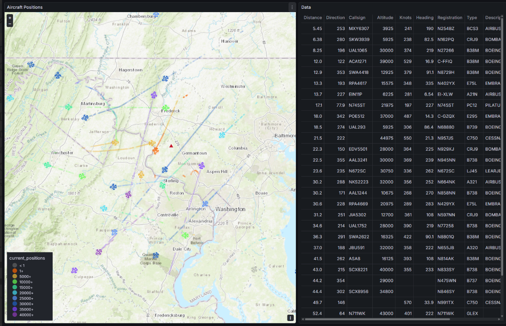

# ADS-B Position Collection on ClickHouse

## Overview

At any time, there may be over 12000 aircraft broadcasting their position through high frequency VHF signals. 
Nearly every commercial airliner and most civilian aircraft continuously stream their positions to a
network of listening stations.  These stations, in turn, relay this data to a variety of commercial and 
privately-run networks which aggregate and share the collected position data.

This project leverages ClickHouse, an efficient and scalable columnar database, to consume ADS-B data from a
variety of sources.  In addition to collecting real-time signals from local commercial aircraft in my local area,
it also polls worldwide position data from multiple online sources at varying polling rates.  The current
volume is only a couple million position reports per hour, which easily runs in containers on home PCs.
The ClickHouse cluster is being migrated to AWS, where it is being scaled up to handle larger load.  The core 
data feeds (and Kafka pipeline) will continue to feed from my house.

This repository contains Kubernetes manifests for deploying:
- **ADS-B Scrapers**: A simple Python-based container which ingests position data from a variety of sources,
  and ingests it into Kafka
- **Kafka + Zookeeper**: Kafka broker with TLS-enabled external access and mTLS authentication.
  (Soon to be replaced with Redpanda)
- **Clickhouse + Keepers**: Built with the Altinity ClickHouse Operator, I have a single node running locally,
  and am standing up others as testbeds in AWS/EKS, and elsewhere
- **Grafana + Prometheus**: Grafana provides live visibility into the various ADS-B data streams, including real-time world
  map views. Additional dashboards enabled through the Altinity Operator, provide system health and performance metrics.

## Prerequisites

In order to retrieve public ADS-B position data in bulk, must public feeds require that you also be an ADS-B feeder.
The steps required to set up an ADS-B receiver are beyond the scope of this document, but I recommend the following project:
https://github.com/sdr-enthusiasts/docker-adsb-ultrafeeder

Once you have a local feeder running, you are able not only to ingest your own ADS-B receiver's data, but you can also
poll some of the public feeds to which you are a contributor.  Examples include airplanes.live, adsb.lol, adsb.one, and others.
Generally, you will need to run your scrapers from the same location (public IP) where your ADS-B reciever feed originates from.

## Setup
For EKS deployments of Clickhouse and monitoring components, refer to docs/ANSIBLE_EKS_DEPLOYMENT.md
This requires that you have access to a kafka/redpanda cluster, and TLS keypairs for client authentication (see certs/README.md)

For local k8s/k3s/etc lab deployments, including Kafka and the adsb scraper/producers, review docs/LOCAL_DEPLOYMENT.md
